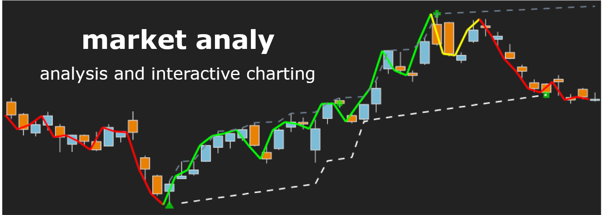

<!-- NB any links not defined as aboslute will not resolve on PyPI page -->
<div align="center">
  <br>
</div>

-----------------

# market_analy

[](https://pypi.org/project/market-analy/)  [](https://github.com/psf/black)

A python package for interactive charting and analysis of financial instruments.

Functionality includes **defining and visualising trends**.

Interactive charting is offered via guis created from widgets of the [bqplot](https://github.com/bqplot/bqplot), [ipywidgets](https://github.com/jupyter-widgets/ipywidgets) and [ipyvuetify](https://github.com/widgetti/ipyvuetify) libraries. Users can use the underlying parts to develop their own interactive charts and analyses. Contributions very much welcome! This is a WIP and it's anticipated that further analyses will be added.

There's a load of great financial libraries out there. This library isn't reinventing the wheel (not intentionally anyway), rather it principally provides functions and interactive charting that I think are useful and couldn't find elsewhere.

## Video tutorials

The following videos cover what's on offer:
* [General tutorial](https://vimeo.com/801302973) demonstrates the functionality as of the initial release (February 2023).
* [Trends](https://vimeo.com/835495038) demonstrates functionality (added June 2023) to define and visualise trends.

## Quickstart
All analyses can be accessed via the classes `Analysis` (single instrument analyses) and `Compare` (to compare multiple instruments). For example:

```python
from market_prices import PricesYahoo
from market_analy import Analysis,  Compare

prices = PricesYahoo("MSFT")
# OR if Yahoo API endpoints are not all currently available in your region...
prices = PricesYahoo("MSFT", calendars="XNYS", delays=0)
analy = Analysis(prices)
gui = analy.plot(days=30)
```
https://user-images.githubusercontent.com/56914820/220773777-df0d0bec-bbe1-45bb-b067-d679666450cd.mp4

```python
trend_kwargs = {
    "prd":60,
    "ext_break":0.05,
    "ext_limit":0.03,
    "min_bars":5,
}
gui = analy.trends_chart(
    "1D",
    trend_kwargs,
    years=3,
)
```
https://github.com/maread99/market_analy/assets/56914820/998c7f46-20f5-43f1-8b82-c857c0702cee

```python
comp = Compare(PricesYahoo("MSFT, AMZN, TSLA"))
# OR if Yahoo API endpoints are not all currently available in your region...
comp = Compare(PricesYahoo("MSFT, AMZN, TSLA", calendars="XNYS", delays=0))
gui = comp.plot(hours=30)
```
https://user-images.githubusercontent.com/56914820/220773790-1fdabf13-25bb-4205-acc2-6bac9b832dae.mp4

```python
gui = comp.chg_every_interval("20T", days=5, chart=True)
```
https://user-images.githubusercontent.com/56914820/220773802-ae329259-4a4e-4e5e-8d02-d4ee88b8b452.mp4

For further documentation see the [video tutorials](#Video-tutorials) and the [analysis](https://github.com/maread99/market_analy/blob/master/src/market_analy/analysis.py) module.

## Installation and environment

It's recommended that `market-analy` is installed to a new virtual environment created using `venv`.

The package can be installed to the activated environment via pip:

`$ pip install market-analy`

Plots are intended to be created in JupyterLab (they will not load in a notebook opened in VSCode). The 'jupyter' optional dependencies can be specified to additionally install `jupyter` and `jupyterlab` to the target environment.

`$ pip install market-analy[jupyter]`

Alternatively, it's possible to use an existing JupyterLab installation (>=3.0) in a separate environment to that in which `market_analy` is installed. In this case:
* The following dependencies should additionally be installed **in the environment to which JupyterLab is installed**:
  - `ipyvuetify`
  - `bqplot`
* A kernel should be created for **the environment to which `market_analy` was installed**. Executing the following, with any virutal environment activated, will create a kernel and make it available to all installed versions of `jupyterlab`.
  - `python -m ipykernel install --user --name mkt_analy --display-name "market analy env"`

> :warning: If starting JupyterLab from a different environment to the environment in which `market_analy` is installed then **the same versions of `ipyvuetify` and `bqplot` must be installed to both environments**. If either of these packages is subsequently upgraded in one environment then it must also be upgraded in the other. (This is due to the potential for conflicts between the versions in the JupyterLab environment, which are responsible for the frontend, and those in the `market_analy` environment where the backend is defined.)

### Color scheme
The color scheme assumes the package is being used with the JupyterLab dark theme. There are no plans to provide a 'light theme' option (although a contribution would certainly be welcome from anyone seeking one).

### `market-prices` dependency
`market-analy` depends on the [market-prices][market-prices] library for price data. This provides for functionality including:
* defining analysis periods in terms of number of sessions and trading minutes rather than calendar days and times.
* complete data sets regardless of liquidity (regular data points during market hours, no data points outside of market hours).

Most of the arguments available to the market-prices `get` function can be passed directly to the `market_analy` functions. See the [market-prices][market-prices] documentation for further info.

## Release schedule, bugs, development and feedback
The first beta version of `market_analy` was released Feb 2023. Functionality to  define and visually interrogate trends was added in June 2023.

The project is immature. Whilst it's not anticipated that major changes will be made to the existing public side, they could be. All that's under-the-bonnet is subject to change as the project evolves. The `guis` module in particular won't permit much further development without overhauling the current inheritance-based approach to a compositional one.

The test suite is somewhat limited. It's pretty much guaranteed that there are bugs. Please raise an [issue](https://github.com/maread99/market_analy/issues) if you find one or come across unexpected behaviour.

Please use [discussions](https://github.com/maread99/market_analy/discussions) to make any suggestions and offer general feedback.

## Disclaimers
`market-analy` should not be assumed sufficiently reliable to undertake analysis intended to inform investment decisions. Users should inspect the source code and the test suite of the library and its dependencies in order to make their own assessment of the packages' suitability for their purposes. **The `market-analy` package is used entirely at the user's own risk.**

The default `market_prices.PricesYahoo` class gets data from publically available Yahoo APIs. **See the [Disclaimers section of the market-prices README](https://github.com/maread99/market_prices#disclaimers) for conditions of use**, including restrictions.

## Alternative packages

* [awesome-quant](https://github.com/wilsonfreitas/awesome-quant) offers an extensive listing of libraries for all things finance.

## License

[MIT License][license]


[license]: https://github.com/maread99/beanahead/blob/master/LICENSE.txt
[market-prices]: https://github.com/maread99/market_prices
